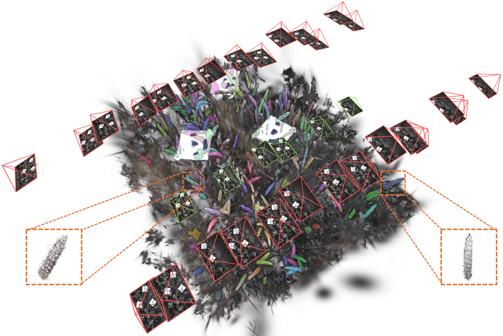

<p align="center">
  <h3 align="center">🌾 Wheat3DGS <br> In-field 3D Reconstruction, Instance Segmentation and Phenotyping of Wheat Heads with Gaussian Splatting</h3>
  <h5 align="center">CVPR 2025 Agriculture-Vision Workshop</h5>
</p>

<div align="center"> 

[Project Page](https://zdwww.github.io/wheat3dgs/) | [Paper](https://arxiv.org/abs/2504.06978) | [Data](https://drive.google.com/drive/folders/1DJPs_E8-93dCysYkQ0-uxHrAcZGTZiVh)

  
</div>

## Updates
- <b>[5/2/2025]</b>  Thx [Tomi](https://github.com/tomedic) for releasing code for wheat head morphology calculation at `wheatheadsmorphology`!
- <b>[4/30/2025]</b> Initial code release 

## 📝 TODO List
- \[ \] Viser-based 3D wheat head segmentation viewer

## 🛠️ Setup
The setup should be very similar to the original [3D Gaussian Splatting](https://github.com/graphdeco-inria/gaussian-splatting) except we used a modified version of [differential gaussian rasterization](https://github.com/ashawkey/diff-gaussian-rasterization/tree/8829d14f814fccdaf840b7b0f3021a616583c0a1) with support of depth & alpha rendering, and an additional [flashsplat-rasterization](https://github.com/florinshen/flashsplat-rasterization/tree/189c483ffa33dd6d5661343ce496df0c6eb80a0c) submodule. 

```
conda env create --file environment.yml
conda activate wheat3dgs
```

## Using Wheat3DGS
The majority of the Wheat3DGS pipeline can be executed by running this script.
```
sbatch run_wheat_3dgs.sh
```

### Step-by-step instructions

**Step 1.** To train a vanilla 3DGS scene reconstruction using wheat plot images as initialization:
```
python train_vanilla_3dgs.py -s <dataset path> -m <model path> --resolution 1 --eval
```
Note that `resolution` is set to 1 to prevent image downscaling, and the training/test split for evaluation follows the default setting of our dataset.

You can also run `render.py` and `metrics.py` with the same input arguments to evaluate the quality of novel view synthesis on the reconstructed wheat fields (see Sec. 5.1). 

**Step 2 (Optional).** Although wheat head bounding boxes generated by YOLOv5 and 2D segmentations by SAM are already provided in our dataset, please refer to this [Colab notebook](https://colab.research.google.com/drive/1Bz5MiyjpYY1iy37ceSBSfLZCI55roRKl?usp=sharing) to reproduce results. 

**Step 3.** To run 3D segmentation on a wheat plot to identify and associate decoupled 2D wheat heads:
```
python run_3d_seg.py -s <dataset path> -m <model path> --iou_threshold 0.6 --exp_name run1
``` 
| Parameter | Type | Description |
| :-------: | :--: | :---------: |
| `--iou_threshold` | `float` | The IoU threshold for associating rendered and YOLO-SAM-generated 2D segmentations. A higher threshold results in more conservative mask matching. |
| `--exp_name` | `str` | The experiment name used to create the folder for saving all results under `model_path/wheat_head`.

**Step 4.** To generate a video rotating around the reconstructed wheat field for qualitative evaluation of the 3D segmentation results (as shown on our project page), run:
```
python render_360.py -s <dataset path> -m <model path> --render_type <field or head> --exp_name run1 --n_frames 200 --framerate 20 --elevation 45
```
| Parameter | Type | Description |
| :-------: | :--: | :---------: |
| `--render_type` | `field` or `head` | Either render a video rotating around the entire reconstructed wheat field with the 3D segmentation overlaid on it, or a list of close-up videos of individual identified wheat heads. |
|`--n_frames` | `int` | Number of video frames (It’s recommended to set a relatively small value for wheat heads, as hundreds of them will be processed.)|
|`--framerate`| `int` | Framerate. Length of video = `n_frames / framerate`|
|`--elevation`| `int` | Elevation angle for the camera trajectory rotating around the scene. The larger the angle, the more novel the rendered view is, since the training views are captured by an overhead camera. |


## Baseline
To reproduce the baseline results presented in the paper (i.e. [FruitNeRF](https://github.com/meyerls/FruitNeRF)), please refer to the original repository and the scripts in the `scripts` folder.

<!-- ## Results
<p align="center">
  
  
</p> -->

## Visualization

Coming soon!

## Acknowledgement
Our implementation is based on the original [3D Gaussian Splatting](https://github.com/graphdeco-inria/gaussian-splatting) and [FlashSplat](https://github.com/florinshen/FlashSplat). We thank the authors for their revolutionary work and open-source contributions. 

## Citation
If you find our paper useful, please cite us:
```bib
@article{zhang2025wheat3dgs,
  title={Wheat3DGS: In-field 3D Reconstruction, Instance Segmentation and Phenotyping of Wheat Heads with Gaussian Splatting},
  author={Zhang, Daiwei and Gajardo, Joaquin and Medic, Tomislav and Katircioglu, Isinsu and Boss, Mike and Kirchgessner, Norbert and Walter, Achim and Roth, Lukas},
  journal={arXiv preprint arXiv:2504.06978},
  year={2025}
}